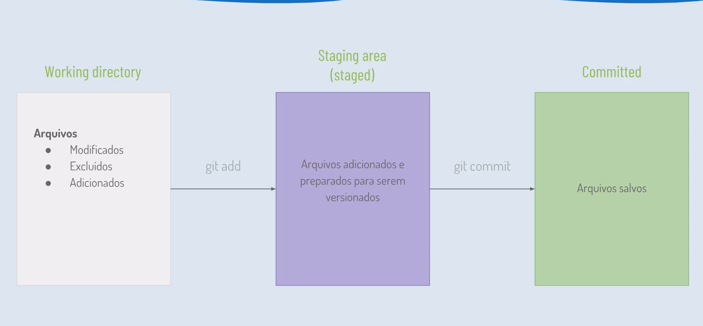
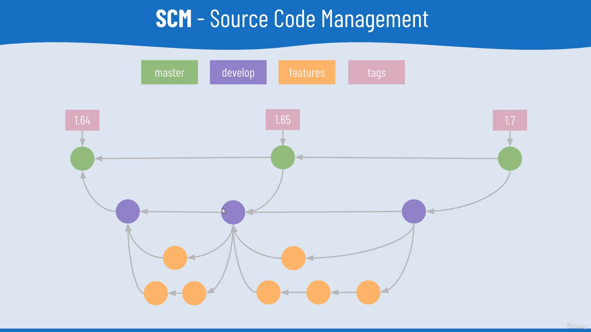

# Acelera ZG

Estudos e anotações referentes aos conteúdos e treinamento do programa de formação “Acelera ZG”

# K0-T0

[Sobre o Linux](arquivos/linux.md)

# K1 - T1

O que é controle de versão? 💻 😀

É um software que tem a função de fazer o gerenciamento de versões de um documento qualquer.

**Uso em empresas de software**

- Gerenciamento das versões de software
- Pequenos ou grandes projetos.

**FUNCIONALIDADES**

**Histórico**

- Alternar entre versões
- Tranquilidade em saber que existe um “plano B” caso as mudanças não deem certo.

**Trabalho em equipe**

- Desenvolvimento em paralelo em diferentes ambientes

**Ramificação**

- Possibilidade de criar várias versões a partir  de um ponto.
- Junção das funcionalidades após finalizadas.

**Rastreabilidade** 

- Identificar em que ponto a mudança foi feita.
- Identificar responsável pela mudança.

### Tipos de Controle de Versão

**CENTRALIZADO**

- Servidor centralizado que possiu todo o histórico.
- Padrão durante muitos anos
    - Subversion (SVN) surgio no ano de 2000
    - Git surgio no final de 2005

**DESCENTRALIZADO** 

- Cada computador possui uma cópia do repositório
    - Alterações rápidas e locais
    - Réplica de repositórios caso o central se perca

**Características do GIT**

**Operações Locais**

- Navegação pelo histórico
- Criação de branch

**Somente adição de conteúdo**

- Mesmo a remoção de arquivo, é feito através de uma adição de versão onde diz que o arquivo foi removido

**Integridade**

- Uma vez um arquivo adicionado, todo seu histórico é mantido

**Autonomia**

- Facilidade para colaboradores realizarem alterações sem a dependência de arquivos.

**FUNCIONAMENTO DO GIT (estados dos arquivos)**

Working directory: Diretório de trabalho

—> git add

Staging area (staged): Área de preparação

—> git commit -m “”

Commited: Arquivos salvos

 

**Instalação do GIT no Windows:** Baixo diretamente do site do git, após é somente proceder com a instalação.

**Instalação do GIT no Linux:** 

—> apt-get install git

—> git

—> git —version

**Configuração de usuário:**

—> git  config —global [user.name](http://user.name) ”Marcone de Freitas Marques”

—> git config —global [user.email](http://user.email) “mmsap1998@gmail.com”

— > git config —list (lista todas as configurações)

**Estados do GIT**

**COMANDOS:**

- Iniciar um repositório:
    
    —> git init
    
- Mostrar arquivos ocultos: —> dir -a
- Mostrar os estados dos arquivos
    
    —> git status
    
- Adicionar um arquivo ao repositório
    
    —> git add nome_do_arquivo
    
    Adicionando todo o conteúdo ao repositório, todas as formas apresentadas abaixo são válidas
    
    —> git add .
    
    —> git add - -all
    
    —> git add -A
    

- Salvando alterações (comitando/salvando)
    
    —> git commit -m “Mensagem a ser adicionada ao commit”
    

- Vizualizar alterações
    
    —> git diff (mostra todas as modificações feitas)
    
    —> git diff  - - cached (Diferenças na área de preparação)
    
    —> git diff  - -staged (Mostra as configurações)
    
- Histórico de alterações
    
    —> git log (Passa uma listagem de todas as modificações feitas no repositório, da última para a primeira alteração feita)
    
    —> git log —oneline (todas as midificações em uma única linha)
    
    [Git+log+-+Variações.pdf](arquivos/Gitlog-Variaes.pdf)
    
- Usando commits anteriores
    
    —> git checkout (versão)
    
    (Posso usar esse recurso para poder detectar falhas, adições etc em um projeto, voltando commit por commit)
    
    —> git checkout master (volta a última versão comitada)
    

- Desfazer alterações
    
    —> git checkout nome_do_arquivo (Em arquivos já presentes no repositório)
    
    —> git reset - - hard (Desfaz todas as alterações, como se não houvessem nenhuma alteração feita)
    
- Desfazendo alterações não rastreadas
    
    —> git clean - f (Força apagar arquivos adicionados mas não rastreados)
    
- Ignorando arquivos
    
    —> touch .gitignore (Criar o arquivo .gitignore usando o terminal linux)
    
- Clonando um repositório
    
    —> git clone (Passando o parâmetro do que eu gostaria de clonar, posso baixar todo o histórico do projeto em questão) 
    
    ## Git Hub
    
    O git hub é muito utilizado atualmente com mais de 40 milhões de repositórios.
    
     Comandos:
    
    —> git puch (envia alterações para o git)
    
    —> git pull (baixa os arquivos que foram modificados)
    
    **Star, fork e Pull Request**
    
    - O Star serve para poder adicionar um projeto no meus favoritos.
    - O Watch serve para para observar a evolução do projeto e receber atualizações sobre o mesmo.
    - O fork realiza uma copia com todo o histórico de um projeto, por exemplo quando eu vejo um projeto legal que quero realizar alterações e contribuir, com o fork cria um repositório no meu git hub possibilitando tais modificações.
    - Pull Request envia uma sugestão de modificação ou contribuição para um determinado projeto.
    - Issues serve basicamente para que possamos relatar algum erro que eu indentifiquei em um projeto. Por exemplo estou vendo um projeto de outra pessoa que acabei gostando, mas ao analisar o código encontrei alguns possíveis erros, assim ao criar um issues estou relatando tal erro ao dono do projeto.
    - Milestones serve para fornecer informações sobre o andamento das atualizações referentes a issues e pull requests
    - Labels servem para eu poder marcar com uma tag de indentificação as issues. Assim, quando eu leio uma issue sugerida para o meu projeto posso classificar o que eu consegui indentificar com aquela sugestão de issue. (Pode ser indentificada com as labels que já existem por padrão no git hub ou também posso criar novas labels).
    
    Arquivo REDME —> Possui a funcionalidade de informar sobre o que se trata determinado projeto. Nele podemos informar o objetivo do projeto, e informações relevantes como suas funcionalidades e dores que o mesmo se propõe em resolver. O arquivo readme possui mais semelhança com um arquivo html com um txt, pois o mesmo é um arquivo de marcação. Podemos usar o Dillinger para poder criar nosso arquivo.
    
    ## BITBUCKET
    
    Muito semelhante ao github, mas no momento o foco esta no GItHub.
    
    ## Comandos intermediários e avançados
    
    - Branch: É uma ramificação no projeto que permite que funcionalidades sejam desenvolvidas separadamente sem impactar funcionalidaes estáveis no projeto.
        - git branch (lista todas as branch existentes)
        - git branch nome_da_branch
        - git checkout -b nome_da_branch (faz a mudança de branch para branch)
        - git branch -d nome_da_branch (remove a branchs locais)
            - Se ele não permitir podemos forçar a remoção usando
                - git branch -D nome_da_branch
        - git push - -delete  origin  nome_da_branch (Apaga a branch do servidor)
        - git branch -m novo_nome-Update (Estando na branch)
        - git branch -m antigo_nome-Update novo_nome (Não estando na branch)
        
        —> Uma **branch** serve para isolar partes do código. Em geral, é usado para isolar o que está sendo desenvolvido do que está sendo publicado. O código de produção, que está publicado para os usuários, na **branch** master.
        
        - git checkout master (entro na branch que desejo mergear)
            - git merge nome_branch_que_puxo_as_alterações(Trás as alterações para a branch em que eu estou)
        
        **SCM - Source Code Management**
        
        
        
        **Pull Request**
        
        É uma requisição de mudança. Ele é muito importante pois caso eu verifique a necessidade de ser feita uma alteração no projeto, porém eu não tenho certeza se tal alteração será necesário ou se a mesma não irá causar problemas no projetos, posso criar uma pull request a qual só será mergeada caso o proprietario do projeto autorizar a mesma.
        
        **Tags**
        
        Uma tag é muito importante pelo fato que muitos projetos demandam de longos períodos de tempo para serem desenvolvidos, no decorrer do seu desenvolvimento inúmeros commits são realizados e as tags servem justamente para marcar pontos onde o projeto atingiu determinado nível de desenvolvimento, por exemplo, quando finalizar uma determinada funcionalidade podemos mar que naquele momento tivemos uma fase do projeto sendo concluída. Para criar uma tag podemos fazer o seguinte: 
        
        —> git tah -a nome_tag -m “mensagem”
        
        - Enviar uma tag para o repositório
            
            —> git push origin nome_tag
            
        - Removendo uma tag
            
            —> git tag -d nome_tag (local)
            
            —> git puh —delete origin nome_tag (servidor) 
            
        - Tag em commit antigos
            
            1ª Forma
            
            git log —oneline (encontrar o commit)
            
            git checkout nome_commit (entrar no commit)
            
            git tag -a nome_tag -m “mensagem” (criar a tag)
            
            —> git push origin nome_tag (associa ao commit a tag)
            
            2ª Forma
            
            git log —oneline (encontrar commit)
            
            git tag -a nome_tag nome_commit (Criando diretamente no commit)
            
            **Stash**
            
            Guarda as alterações do repositório local e armazena na memória local do git.
            
            —> git stash
            
            —> git stash list
            
            —> git stash apply (aplica)
            
            —> git stash pop (aplica e remove)
            
            —> git stash 
            
            **Como desfazer commits** 
            
            —> git reset —hard HEAD~num_commits_a_serem_desfeitos (local)
            
            **Fetch**
            
            —> git fetch (trás atualizações do repositório não local (github)). Ele trás as atualizações para o repositório local porém não aplica as mesmas. Para poder ver as atualizações uso:
            
            —> git log origin/nome_branch —oneline
            
            **Alias:** 
            
            Permite configurar os comando para que os mesmos sejam menores
            
            —> git config - -global alias.s status (cria)
            
            —> git config - - global - - unset alias.s (remove)
            
            **Remote**
            
            Acessar a url associada a um projeto
            
            —> git remote -v
            
            **Grep**
            
            —> git branch | grep padrao_de_busca (Lista todas as branchs com o padrão de busca informada)
